# Purpose

Purpose is to test the ability to create draw.io diagrams with Gemini after first tinkering with the look of the diagram in gemini.

# Test 1 Diagram from Doc Content
Had gemini create an infographic of the control plane access method for GKE based on the documentation link [https://docs.cloud.google.com/kubernetes-engine/docs/concepts/network-isolation](https://docs.cloud.google.com/kubernetes-engine/docs/concepts/network-isolation)


It generated the following infographic:

```
Can you generate an infographic explaining the concepts of control plane access methods covered here https://docs.cloud.google.com/kubernetes-engine/docs/concepts/network-isolation
```


Asked Gemini to produce an xml version of the diagram to open in draw.io.


After Gemini produced the xml for import to draw.io, the diagram opened properly:


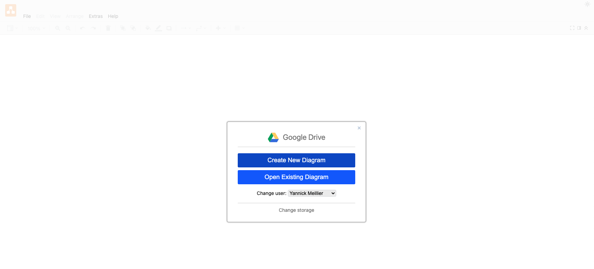


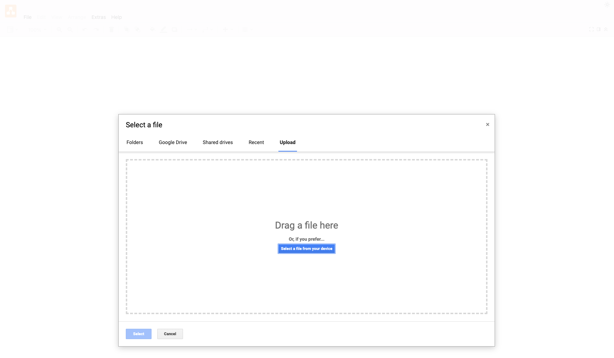


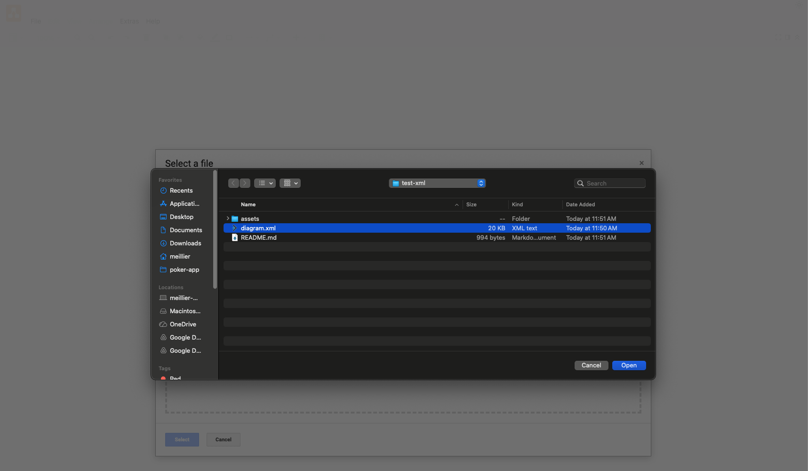


# Test 2: From Infographic as input

The image is fed as the input. Altho it was generated by Gemini, it was done on a different chat and here we are just feeding gemini an image.

We will see if Gemini 3 can create an xml for this diagram (also generated by nano banana)

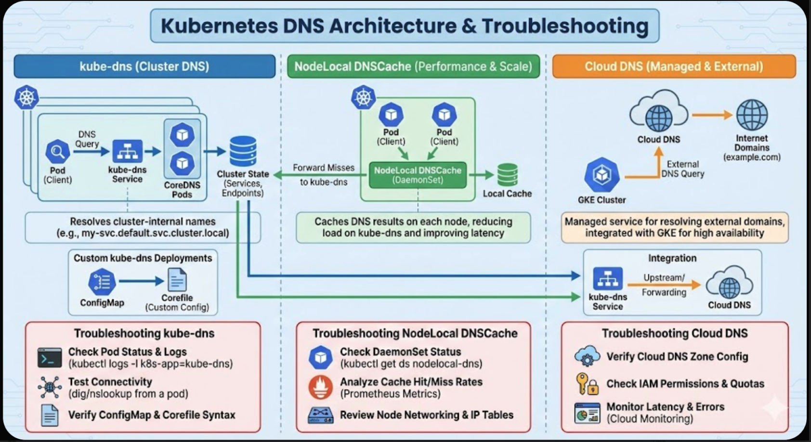


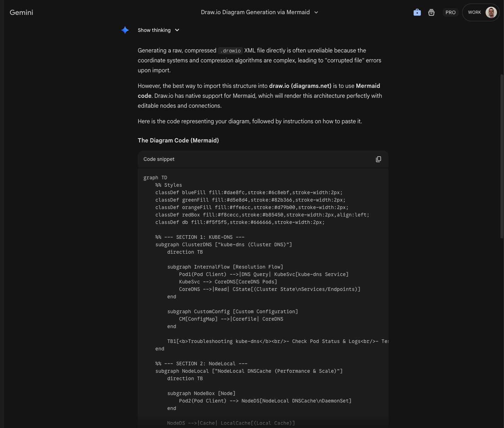


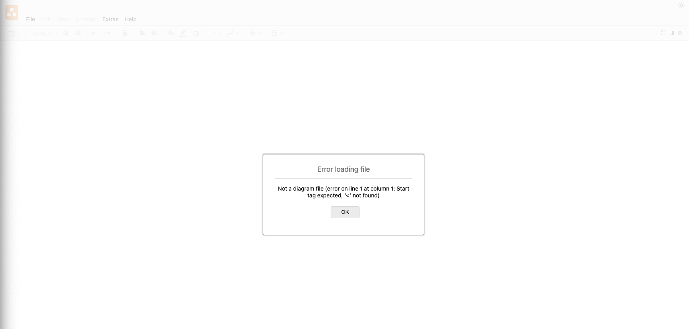
will have to tinker with that one....


# Test 3: Regenerate Existing Image & generate .xml

Now what if you wanted to expand upon an already existing architectural diagram that you unfortunately did not create yourself.

[https://docs.cloud.google.com/architecture/build-apps-using-gateway-and-cloud-service](https://docs.cloud.google.com/architecture/build-apps-using-gateway-and-cloud-service)
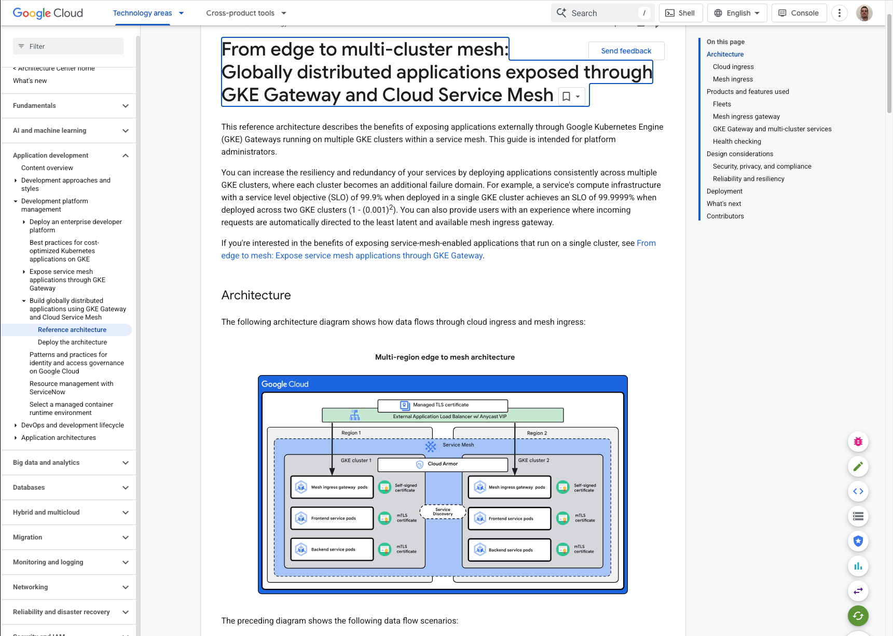


Have gemini recreate the image, maybe it will then be able to generate the draw.io xml :
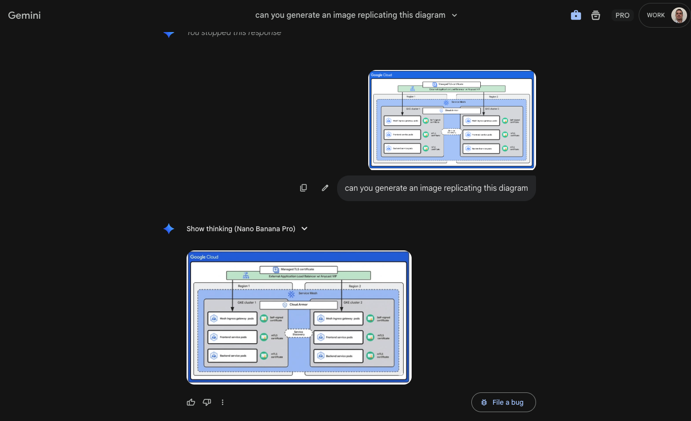
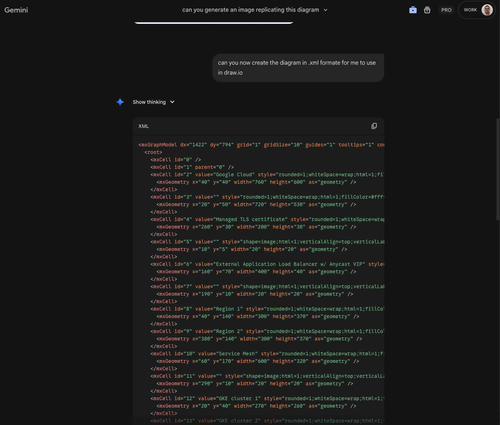


# Test 4: Architectural Diagram v2

https://docs.cloud.google.com/architecture/multiagent-ai-system
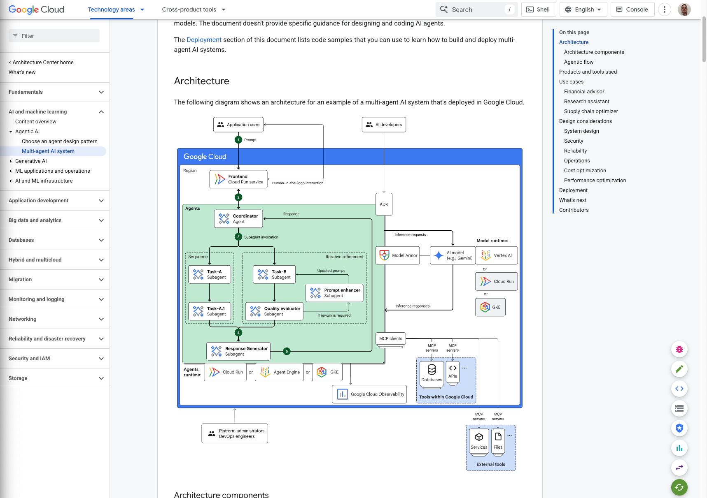


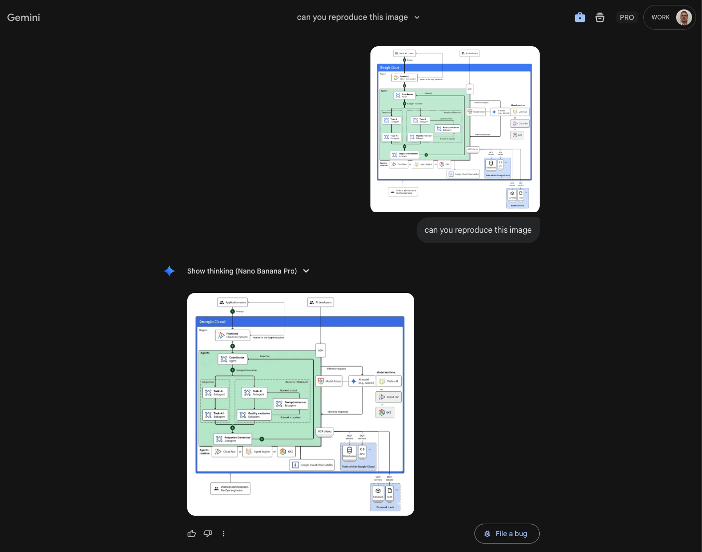

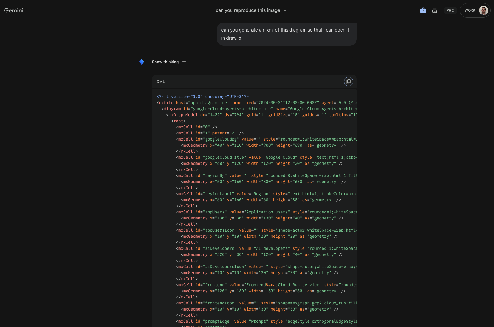


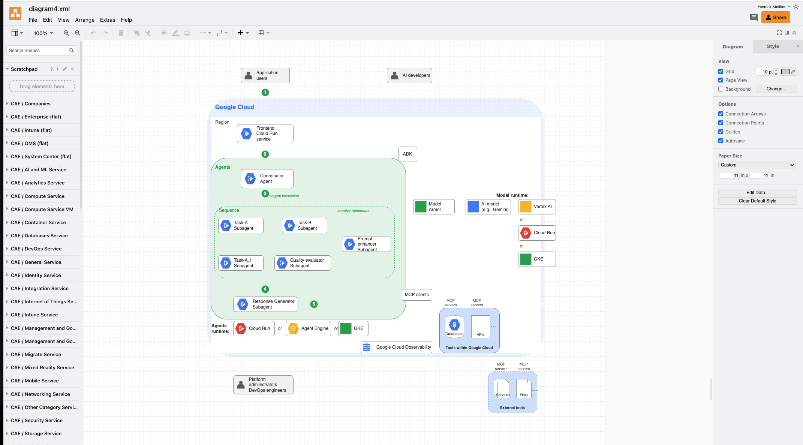

Not 100% but good starting point...