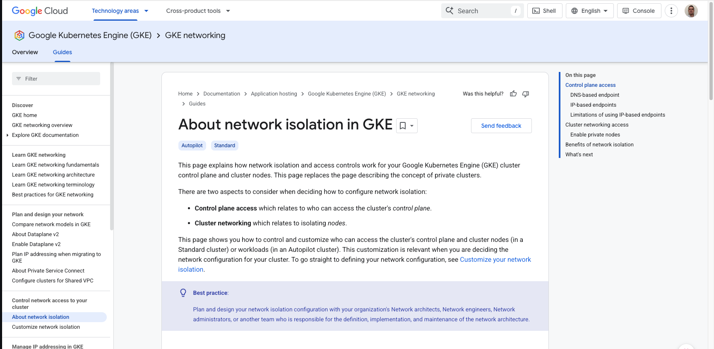
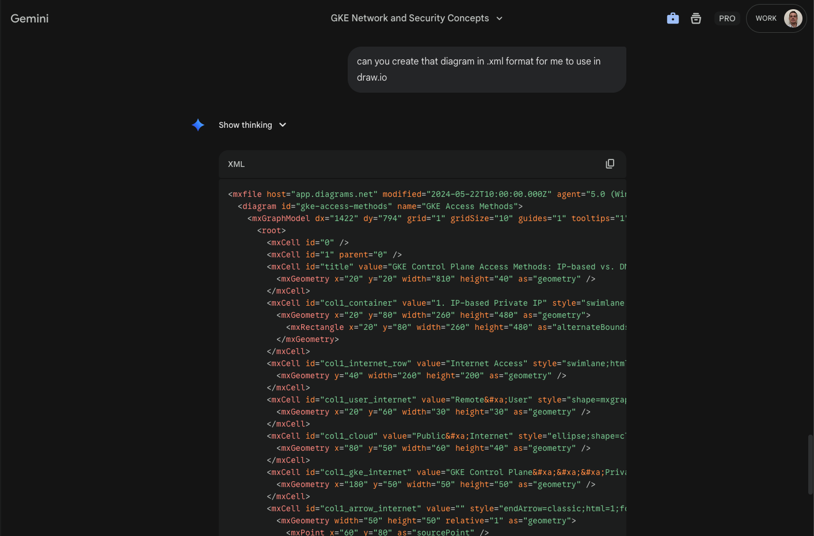
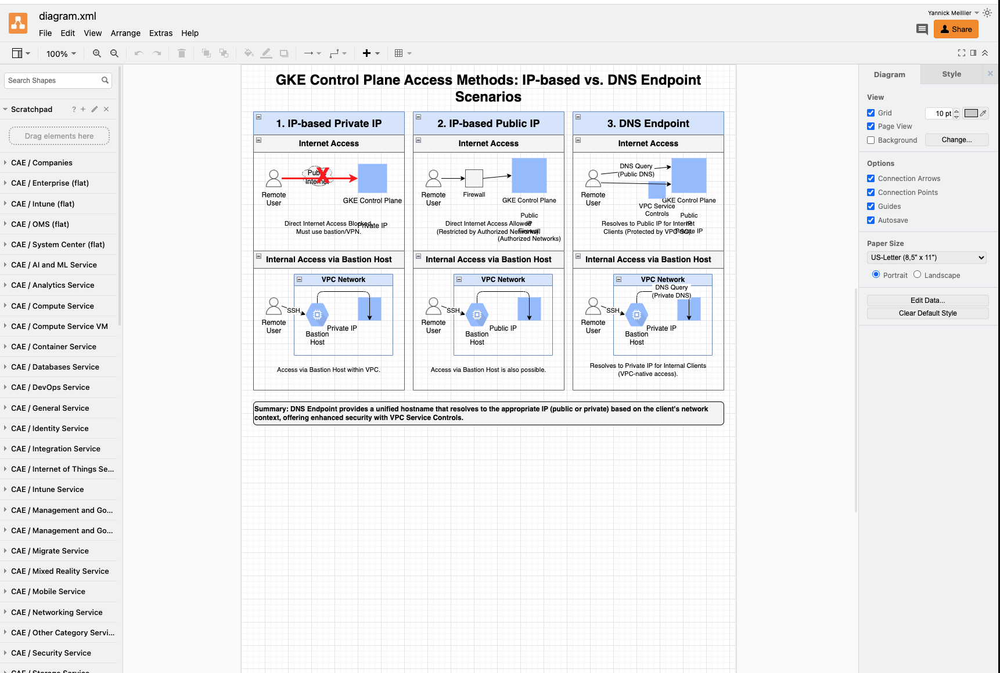

Purpose is to test the ability to create draw.io diagrams with Gemini after first tinkering with the look of the diagram in gemini.


Had gemini create an infographic of the control plane access method for GKE based on the documentation link [https://docs.cloud.google.com/kubernetes-engine/docs/concepts/network-isolation](https://docs.cloud.google.com/kubernetes-engine/docs/concepts/network-isolation)



It generated the following infographic:

```
Can you generate an infographic explaining the concepts of control plane access methods covered here https://docs.cloud.google.com/kubernetes-engine/docs/concepts/network-isolation
```


Asked Gemini to produce 



After Gemini produced the xml for import to draw.io, the diagram opened properly:




